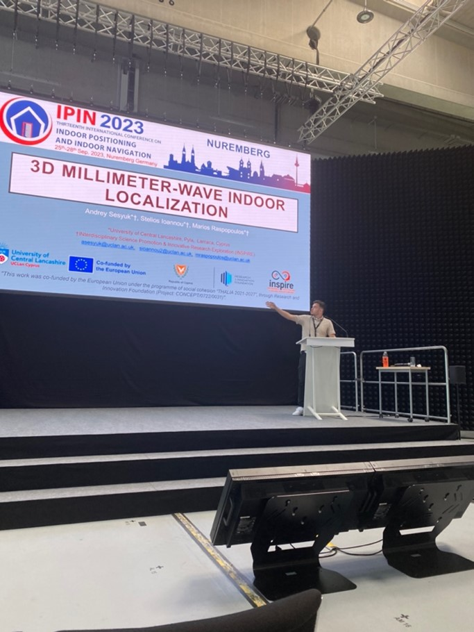
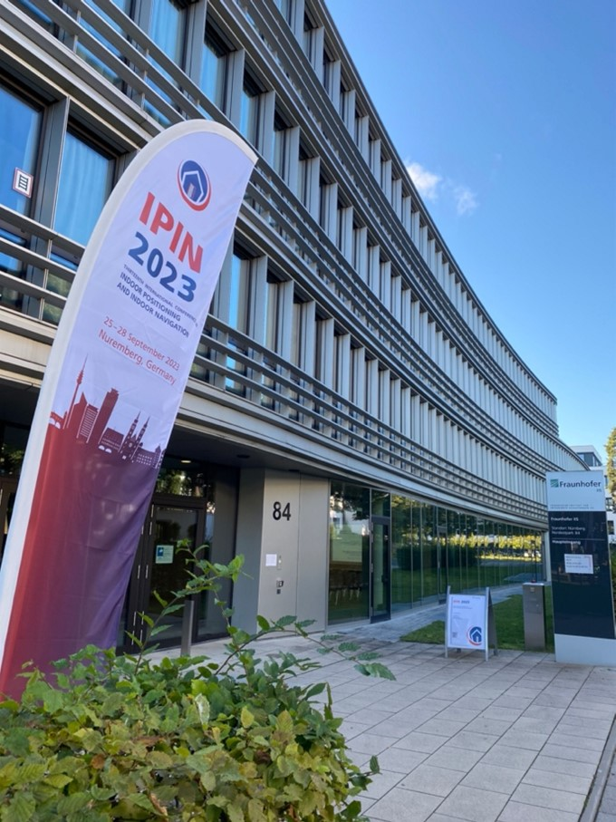
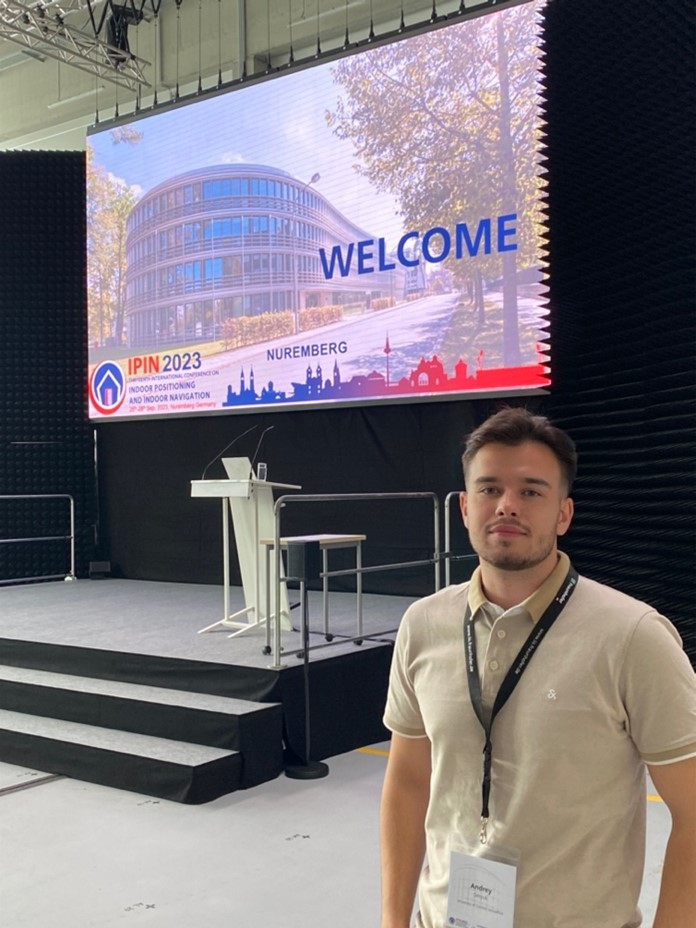
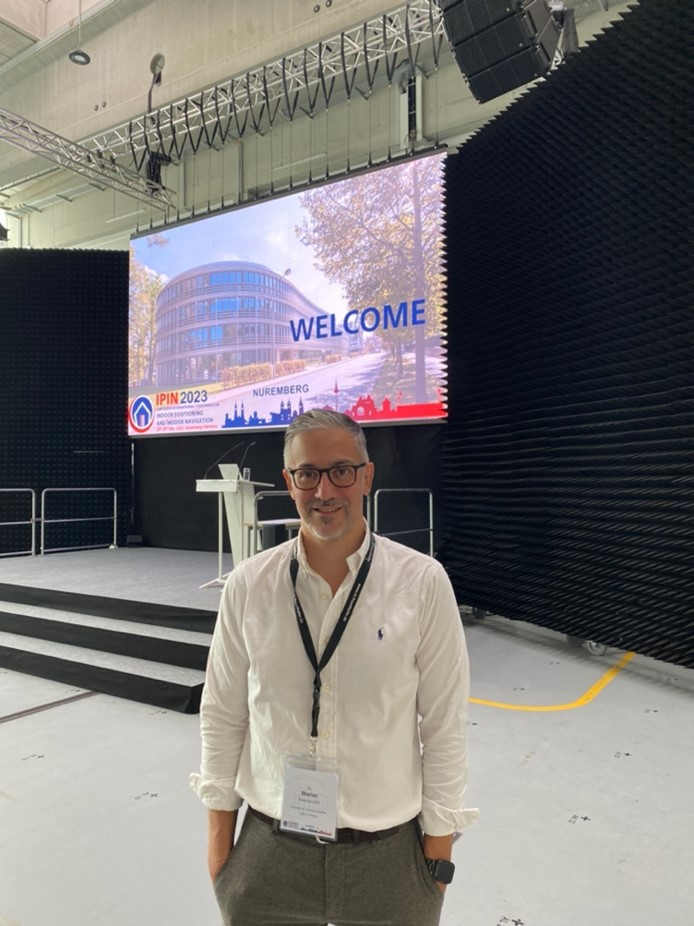

# Description
The general objective of this project is the adaptation of existing technologies used in a precision agriculture (PA), into an indoor (greenhouse) prototype system which includes the use of both an unmanned ground and aerial vehicles (UGV and
UAV). The term precision agriculture refers to the use of information technologies (IT) to help farmers manage the optimal growth of their crops thus ensuring profitability and sustainability. Furthermore, PA has also been known to help the
environment by avoiding unnecessary spaying of pesticides as well as excessive use of water and fertilisers. The use of unmanned systems offers higher spatial resolution data compared to satellites. The real-time data of interest to the farmers
and management tools/software includes soil properties such as moisture, compaction, salinity and nutrients (nitrogen (N), phosphorus (P) and potassium (K)), and crop monitoring which includes vegetation indexes such as Chlorophyll, Leaf Water,
Ground Cover, Leaf Area, Normalised Difference Vegetation Index (NDVI), etc. UAVs have been used in PA for bird eye view, for insect identification using cameras and Lidars, and even actuators for autonomous spraying of pesticides, whereas the use
of UGVs provides bottom-up capabilities identifying insects hiding under the leaves and for crop planting and harvesting. The innovation of this project is the UGV and UAV for indoor (greenhouse) PA applications where GPS signals are very weak or
non-existent. In addition, this work will validate high-precision cm-level, 3D positioning techniques required for unmanned vehicle indoor localisation and navigation

**Funding Body:** Cyprus Research and Innovation Foundation

**Project ID:** CONCEPT/0722/00100

**Duration:**: 1st April 2023 - 31st December 2023 (9 months)

**Funding Received:** 39.902,56 Euros

**Host Organization:** [Center of Interdisciplinary Science Promotion and Innovative Research Exploration (InSPIRE)](http://inspirecenter.org/)

**Coordinator:** - [Dr Stelios Ioannou](https://www.uclancyprus.ac.cy/academic/dr-stelios-ioannou/)

**Researchers:** - [Dr Marios Raspopoulos](https://www.uclancyprus.ac.cy/academic/dr-marios-raspopoulos/) , [Mr Andrey Sesyuk](https://www.linkedin.com/in/asesyuk/), Mr Demetris Kallasides

# News
#### (31 December 2024)
Project Ends

<!---
##### (23 Jauary 2024)
Paper titled 'Radar-based millimeter-Wave sensing for accurate 3D Indoor Positioning - Potentials and Challenges' gets accepted to the Journal on Indoor Seamless Positioning and Navigation

#### (06 December 2023)
[IPIN Paper](https://ieeexplore.ieee.org/document/10332537). gets published on IEEExplore

#### (25 September 2023 - 28 September 2023)
Project Team participates to the 13th International Conference on Indoor Positioning and Indoor Navigation (IPIN) was organized by the Fraunhofer Institute for Integrated Circuits IIS with the support of researchers from the German Aerospace Center (DLR) and the Stuttgart University of Applied Sciences. 

        
--->

#### (1st April 2023) 
Project Starts

# Videos

# Deliverables
- [Deliverable 3.1](/deliverables/THESIS_D3.1.pdf)
- [Deliverable 3.2](/deliverables/THESIS_D3.2.pdf)
- [Deliverable 4.1](/deliverables/THESIS_D4.1.pdf)
- [Deliverable 4.2](/deliverables/THESIS_D4.2.pdf)

# Publications

- A. Sesyuk, S. Ioannou and M. Raspopoulos, "3D millimeter-Wave Indoor Localization," 2023 13th International Conference on Indoor Positioning and Indoor Navigation (IPIN), Nuremberg, Germany, 2023, pp. 1-7, doi: [10.1109/IPIN57070.2023.10332537](https://ieeexplore.ieee.org/document/10332537).
- A. Sesyuk, S. Ioannou and M. Raspopoulos, "Radar-based millimeter-Wave sensing for accurate 3D Indoor Positioning - Potentials and Challenges," in IEEE Journal of Indoor and Seamless Positioning and Navigation, doi: [10.1109/JISPIN.2024.3359151](https://ieeexplore.ieee.org/document/10415170).
